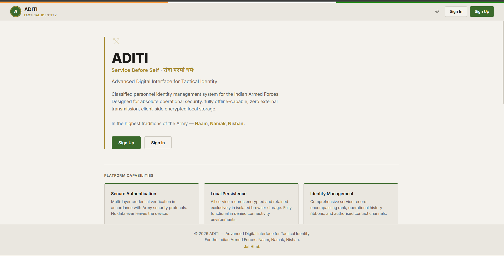
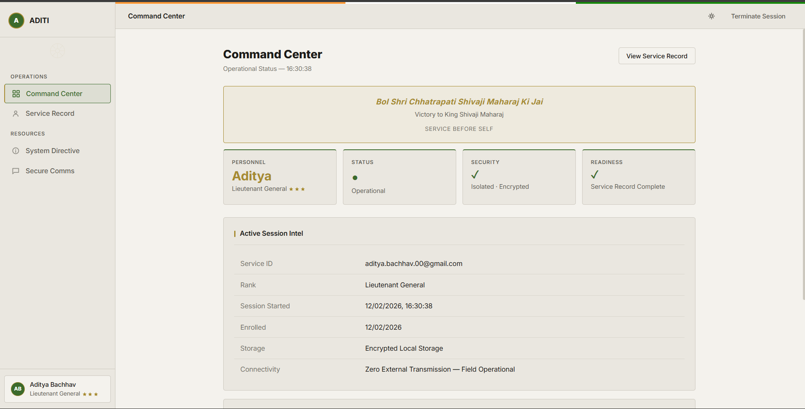
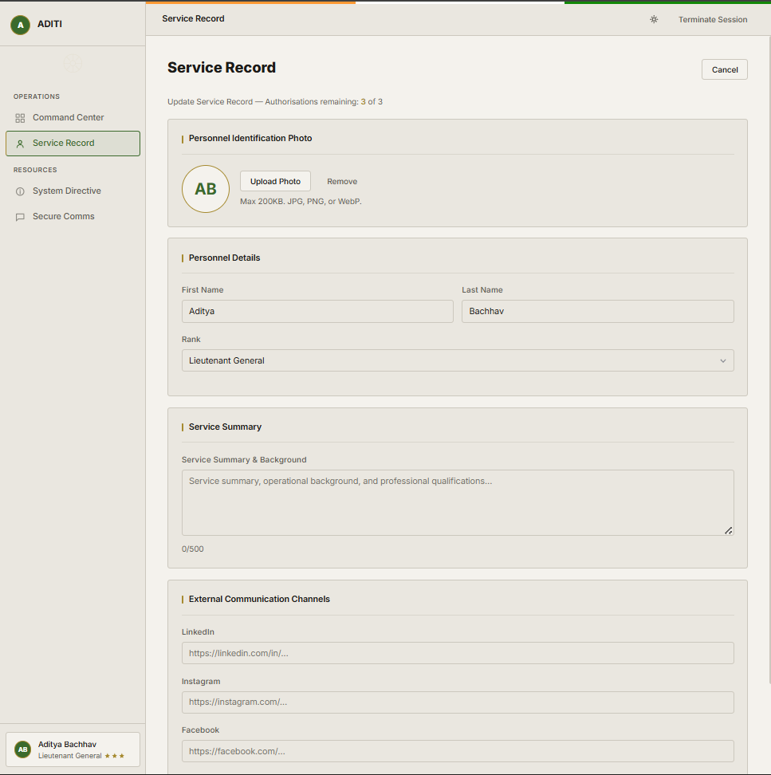
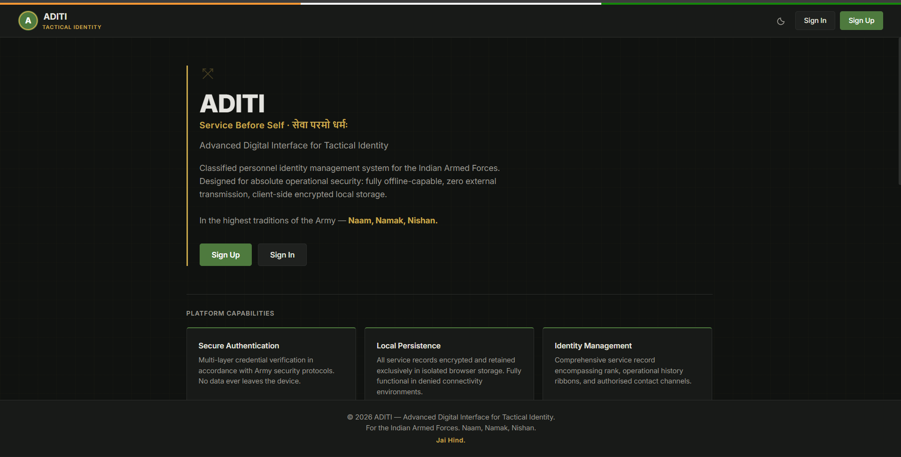

# ADITI — Advanced Digital Interface for Tactical Identity

> **Service Before Self · सेवा परमो धर्मः**

🇮🇳

A fully offline, client-side personnel identity management system themed for the **Indian Armed Forces**. Designed with operational security in mind: zero external transmission, encrypted local storage, and complete functionality in denied connectivity environments.

**Naam, Namak, Nishan.**

> *This is a demonstration project built with vanilla HTML, CSS, and JavaScript — no dependencies, no backend, no data ever leaves your device.*

---

## Live Demo

🔗 **[aditi.vercel.app](https://aditi.vercel.app)**

*(Or open `index.html` locally to run offline)*

---

## Features

| | Feature | Description |
|---|---|---|
| 🔐 | **Secure Authentication** | Multi-layer credential verification using service email and password. Sessions persist locally. |
| 💾 | **Local Encrypted Persistence** | All data stored exclusively in browser localStorage. No servers, no cloud, no transmission. |
| 📋 | **Comprehensive Service Record** | Rank with text-based insignia, operational history (missions/ribbons), regiment war cries, social links, and personal bio. |
| 🌗 | **Field / HQ Adaptive Theme** | Light mode (Headquarters) and dark mode (Field) with automatic preference retention. |
| 📊 | **Command Center Dashboard** | Operational overview with readiness indicators, session status, and authorised actions. |
| 📨 | **Secure Comms** | Local message dispatch system with categorised protocols. |
| 🚀 | **Onboarding Flow** | Guided setup for new personnel including contact verification and mission history selection. |
| ✏️ | **Profile Management** | Edit personal details (limited to 3 edits for operational discipline), upload profile picture, and manage social channels. |
| 🎖️ | **Military-Themed UI** | Indian Army-inspired ranks, insignia, war cries (e.g., "Bharat Mata Ki Jai"), and tricolor accents. |

---

## Screenshots

---

## How to Run

1. Clone or download the repository.
2. Open `index.html` in any modern browser.
3. Register with a service email and password to begin onboarding.
4. All progress is saved locally — clear browser data to reset.

> **No installation required.** Works completely offline after initial load.

---

## Technical Specifications

| Aspect | Details |
|---|---|
| Architecture | Single-page application (SPA) |
| Framework | Vanilla JavaScript |
| Storage | Browser localStorage |
| Dependencies | None |
| Network Requirement | Zero external requests after load |
| Security | Client-side only (demo purposes) |
| Languages | HTML (42%), CSS (31%), JavaScript (27%) |

---

## Operational Security Directive

> This system adheres to the principle of **zero external transmission**. All data remains on your local device.

- Passwords are lightly obscured (Base64) for demonstration only — not suitable for real classified use.
- This is a concept/demo project and should **not** be used for actual sensitive information.

---

## Contributing

Contributions are welcome in the finest traditions of camaraderie. Fork, enhance operational capabilities, and submit a pull request.

---

## License

MIT License

---

*The safety, honour, and welfare of your country come first, always and every time.*

*The honour, welfare, and comfort of the men you command come next.*

*Your own ease, comfort, and safety come last, always and every time.*

**— Chetwode Credo**

### Jai Hind 🇮🇳

